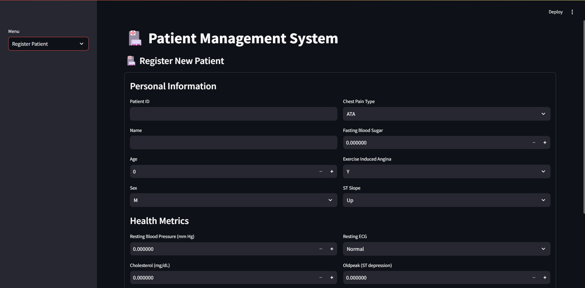
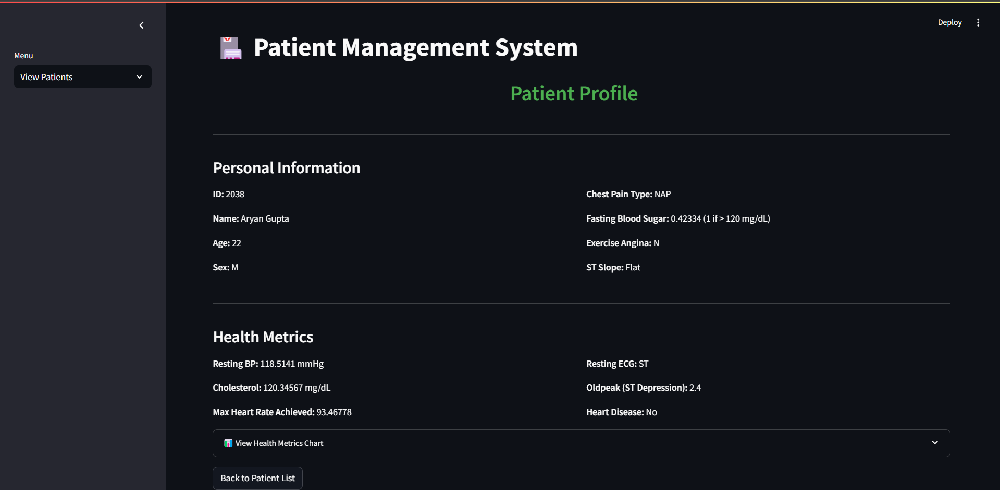

# HeartAttackPrediction

## Register Patient

## Display Patient

## Installation

1. Clone this repository to your local machine.
2. Create a virtual environment `python -m venv myenv`
3. Activate the virtual environment `myenv\Scripts\activate`
4. Install the required dependencies `pip install -r requirements.txt`

## Usage

Run the `main.py` file.

## License

This project is licensed under the [MIT License](LICENSE).
